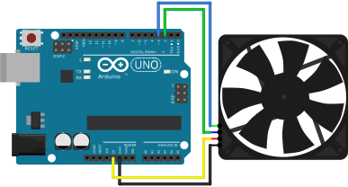
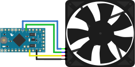

# FourWireFan

## Why four-wire fans?

Three- and four-wire computer cooling fans provide a couple of advantages over generic fans (i.e. simple two-wire cooling fans).

The are specified (see links below) for built-in _polarity protection_, _rotor lock protection_, _auto-restart_, have a _common connector_ and _pinout_, _low commutation noise_ as well as _low power consumption_.

Three- and four-wire fans are currently available as 5V, 12V and 24V devices.

## Keeping it simple

In order to get started quickly I recommend the 5V fan variants for safety and simplicity reasons (no 12V or 24V power source required, lower likelihood of accidentally frying the electronics).

See the following wiring diagrams:

## Fan speed, noise and reliability

A computer cooling fan runs more quietly and more reliably at lower speeds.

I considered sensing fan motor load in order to possibly detect dust buildup or obstructed airways.

But I found no reliable way to correllate deviation under load (various dust screens) from expected fan speed (reference measurement).

Fans get louder if turbulences occur. But they aren't necessarily slowed down in a way that can easily be measured.

As an example, the speed of a Noctua NF-A12 drops less than 1% while the airways are almost blocked.

## Further considerations

### Driving multiple fans

> "If driving multiple fans with a single PWM output, an open-drain / open collector output buffer circuit is required."

### Minimum speed

> "The fan shall be able to start and run at [the minimum] RPM."

> "[The fan will] turn off the motor at 0% PWM duty cycle."

### Minimum RPM

> "If no control signal is present the fan shall operate at maximum RPM."

> "For all duty cycles less than the minimum duty cycle, the RPM shall not be greater than the minimum RPM."

### Minimum duty cycle

> "In a Type A implementation the fan will run […] for all PWM duty cycle values".

This means …

> "In a Type B implementation the fan will run […] for all non-zero PWM duty cycle values".

> "In Type C implementation the fan will stop running when the current provided to the motor windings is insufficient".

### Pull up/down resistors

> "The trace from PWM output to the fan header must not have a pull up or pull down. The pull up is located in the fan hub."

## Sources

- Intel specification (Internet Archive, 2018, PDF): [4-Wire Pulse Width Modulation (PWM) Controlled Fans](https://web.archive.org/web/20180619122326/http://www.formfactors.org/developer/specs/4_wire_pwm_spec.pdf)
- Mary Burke, Analog Devices: [Why and How to Control Fan Speed
for Cooling Electronic Equipment](https://www.analog.com/en/analog-dialogue/articles/how-to-control-fan-speed.html#)
- On Semiconductor ADT7467: [Datasheet (PDF)](https://www.onsemi.com/pub/Collateral/ADT7467-D.PDF)
- Noctua NF-A12x25 5V PWM: [Product specifications](https://noctua.at/en/products/fan/nf-a20-5v-pwm/specification)
- Noctua PWM specifications: [PWM specifications white paper (PDF)](https://noctua.at/pub/media/wysiwyg/Noctua_PWM_specifications_white_paper.pdf)
- Chris Petrich, "Your DS18B20 temperature sensor is likely a fake": [github.com/cpetrich/counterfeit_DS18B20](https://github.com/cpetrich/counterfeit_DS18B20)